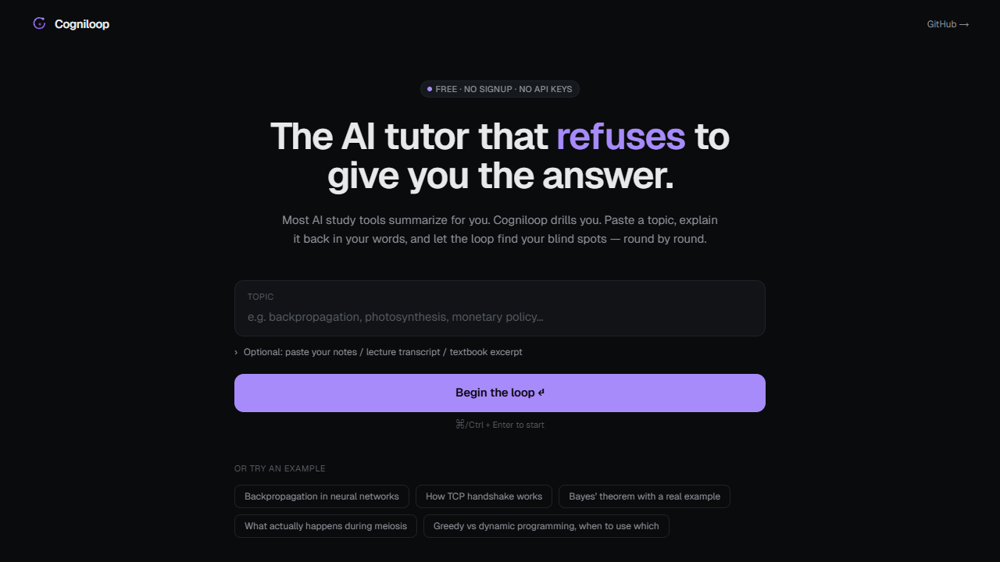

# Cogniloop

<p align="center">
  <a href="https://cogniloop-vaibhav4046s-projects.vercel.app">
    
  </a>
</p>

> The AI tutor that **refuses** to give you the answer.

**Live:** https://cogniloop-vaibhav4046s-projects.vercel.app

Most AI study tools summarize content for you — and quietly destroy your understanding. Cogniloop does the opposite: it forces **active recall** through the Feynman technique, drills you with Socratic questions, evaluates your explanations, and adapts each round to your blind spots.

```
You paste a topic.
Cogniloop extracts the concepts.
Cogniloop asks. You explain.
Cogniloop grades. Cogniloop probes the gap.
Loop until mastered.
```

---

## What it does (35+ shipped features)

**Core loop**
- Locked Socratic system prompt — refuses to give answers, forces explanation
- 5 question types: explain, apply, contrast, predict, trace
- Adaptive difficulty 1–5, scales with your performance
- 0–3 scoring rubric per round with verdict + gaps + strengths
- Concept state machine: `weak → shaky → solid → mastered`
- Live concept tracker sidebar with progress bars
- 8-round soft cap with smart "should-end" detection

**3 study modes**
- **Chill** — patient, hints generously, low starting difficulty
- **Exam** — strict grading, 90s timer per round, mid-range difficulty
- **Expert** — adversarial, first-principles, starts at difficulty 3

**7 curriculum templates** — pre-loaded concept maps, click-to-start
- JEE Main (Physics, Chemistry, Math — NCERT)
- NEET UG (Bio, Physics, Chemistry)
- GATE CSE (algorithms, OS, networks, ToC, compilers, computer org)
- MCAT (Bio/Biochem, Chem/Phys, Psych/Soc)
- AP Computer Science (CSA + CSP)
- ML Fundamentals (linear algebra, probability, neural nets, transformers)
- System Design (distributed systems, databases, APIs, scaling — interview-ready)

**Input / output**
- Voice input via Web Speech API (Chrome/Edge)
- Read-aloud questions via Speech Synthesis
- LaTeX/KaTeX math rendering in questions, answers, evaluations
- Live math preview while typing
- Markdown export of full session
- URL-encoded shareable session links — no backend, no leaks
- Per-round feedback card with strengths + gaps as bullet lists

**Persistence + accountability**
- Daily streak counter (Duolingo-style)
- 90-day activity heatmap
- Lifetime stats: sessions, rounds, mastered concepts, avg score
- Full session history with searchable list
- localStorage-only — no accounts, no logs, no servers

**LLM layer**
- Multi-provider with automatic fallback
- Default: Pollinations.ai free public endpoint (no API key, no signup)
- Optional: Groq Llama 3.3 70B if `GROQ_API_KEY` env var is set
- Retry with exponential backoff
- Strict JSON mode + multi-strategy parser (raw, fenced, slice)
- Edge runtime on every route

**UX details**
- Sleek dark theme, Linear-inspired
- Geist font, KaTeX math styling
- Keyboard-first: `?` shortcuts panel, `g+t` `g+h` `g+w` quick-nav, `/` to focus, `⌘/Ctrl+Enter` to submit, `e` to end early
- Per-round difficulty dots, mode badges, question-type tags
- Sticky concept tracker on desktop, collapsible mobile
- Session resume on browser refresh
- Empty-state coaching card on the home page

**Pages**
- `/` — landing with mode picker, examples, curriculum cards, feature grid
- `/templates` — full curriculum browser with topic-level filter
- `/history` — heatmap, streak, lifetime stats, session list
- `/why` — comparison table vs ChatGPT/Claude, 7-question FAQ, 6 use cases
- `/study` — the active session
- `/shared/[token]` — read-only view of any URL-encoded session

## Why this beats wrapping ChatGPT yourself

| | Cogniloop | ChatGPT / Claude |
|---|---|---|
| Default behavior | Asks you to explain | Answers immediately |
| Bypass-resistance | System prompt + UI lock | One re-prompt away |
| Concept progress map | Live, structured | None — buried in scrollback |
| Difficulty scaling | Explicit 1–5 | Improvised tone |
| Coaching report | Markdown export, study plan, journal prompt | Loose prose if asked |
| Streak / accountability | Yes | No |
| Curriculum templates | 7 packs, 90+ topics | Cold-start every chat |
| Privacy | Browser-only | Server-stored |
| Cost | $0 forever | $0 limited / $20+ pro |

## Stack

| Layer | Choice |
|---|---|
| Framework | Next.js 16 App Router |
| UI | React 19 + Tailwind CSS v4 |
| Language | TypeScript (strict) |
| Math | KaTeX |
| Runtime | Edge functions on every `/api/*` route |
| LLM | Pollinations.ai (default, no key) → Groq Llama 3.3 70B (fallback) |
| Persistence | `localStorage` (history, streak, in-flight session) |
| Hosting | Vercel |

## Architecture

```
app/
├── page.tsx                  → landing
├── study/page.tsx            → session container
├── templates/page.tsx        → curriculum browser
├── history/page.tsx          → streak, heatmap, sessions list
├── why/page.tsx              → comparison + FAQ + use cases
├── shared/[token]/page.tsx   → read-only session view
└── api/session/
    ├── start/route.ts        → extract concepts + first question
    ├── turn/route.ts         → evaluate + next question
    └── report/route.ts       → coaching report

components/
├── Landing.tsx               → home with input + mode picker + examples
├── Session.tsx               → state machine + question/answer/eval + report
├── TemplatesView.tsx         → curriculum browser with filter
├── HistoryView.tsx           → heatmap + sessions list
├── WhyView.tsx               → comparison + FAQ + use-cases
├── SharedView.tsx            → read-only shared session
├── NavBar.tsx                → top nav with g+x shortcuts
├── ModePicker.tsx            → Chill/Exam/Expert
├── StatsPanel.tsx            → streak / sessions / rounds / avg score
├── VoiceInput.tsx            → Web Speech API mic
├── ReadAloud.tsx             → Speech Synthesis
├── ShortcutsModal.tsx        → ? panel
├── Math.tsx                  → KaTeX renderer with $...$ + $$...$$
└── Logo.tsx

lib/
├── types.ts                  → SessionState, Round, Concept, Evaluation
├── prompts.ts                → SYSTEM_CORE + EXTRACT/EVAL/REPORT + mode overlays
├── llm.ts                    → multi-provider chat() with retry + JSON parser
├── modes.ts                  → Chill / Exam / Expert
├── curricula.ts              → 7 curriculum packs
├── storage.ts                → history, streak, lifetime stats
└── share.ts                  → URL-safe base64 encode/decode
```

## Run locally

```bash
git clone https://github.com/vaibhav4046/cogniloop.git
cd cogniloop
npm install
npm run dev
```

Open http://localhost:3000 — no `.env` required.

Optional: set `GROQ_API_KEY` in `.env.local` for higher-quality / faster responses via Groq Llama 3.3 70B (free tier available at console.groq.com).

## Deploy

```bash
vercel deploy --prod
```

Edge runtime is already configured per route.

## Roadmap

- [ ] Spaced repetition queue across sessions (return weak concepts on a schedule)
- [ ] PDF / image OCR ingestion for textbook pages
- [ ] Classroom mode — teacher generates topic + dashboard, students drill
- [ ] Anki / Obsidian export
- [ ] Self-hostable LLM backend (Ollama)

## Author

Built by **Vaibhav Lalwani** — [github.com/vaibhav4046](https://github.com/vaibhav4046)

## License

MIT
