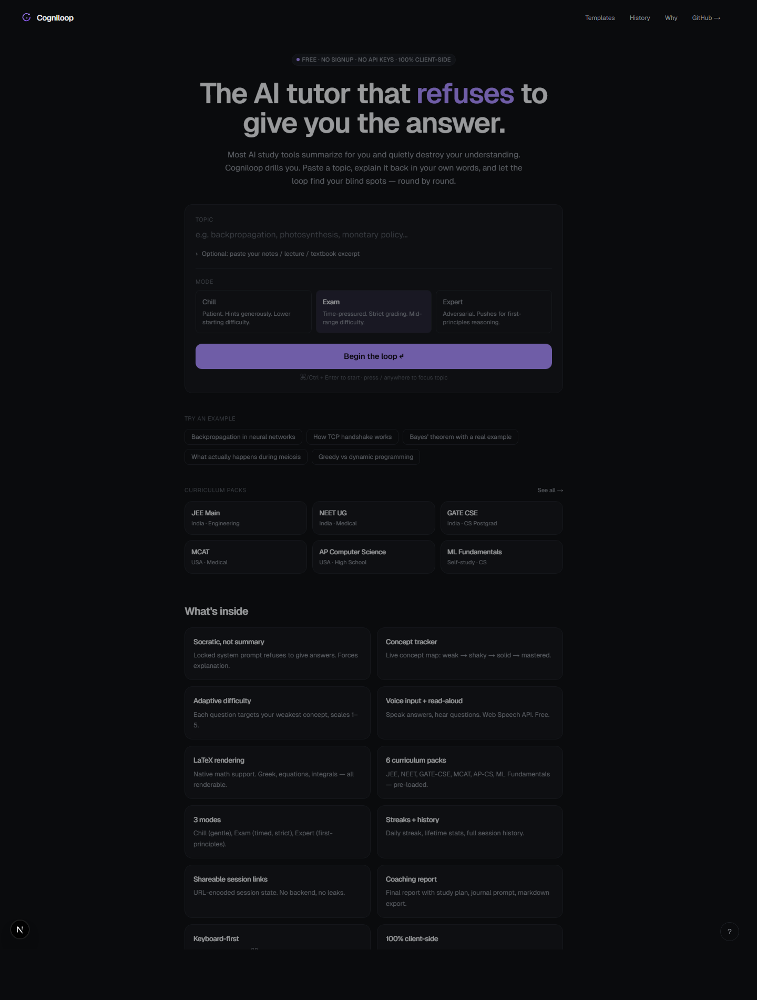
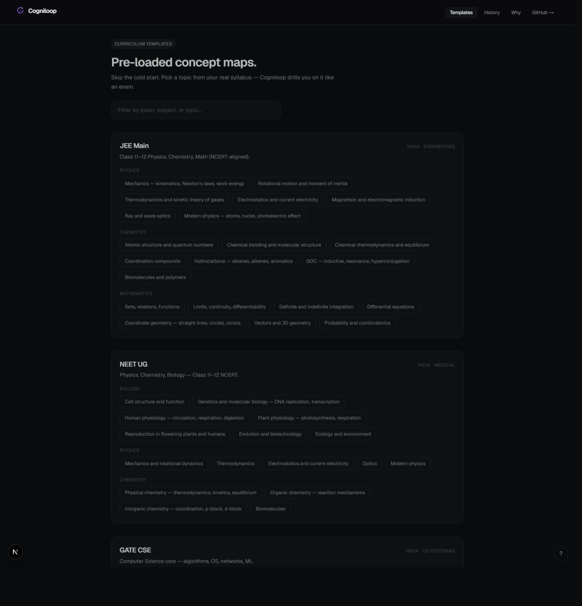
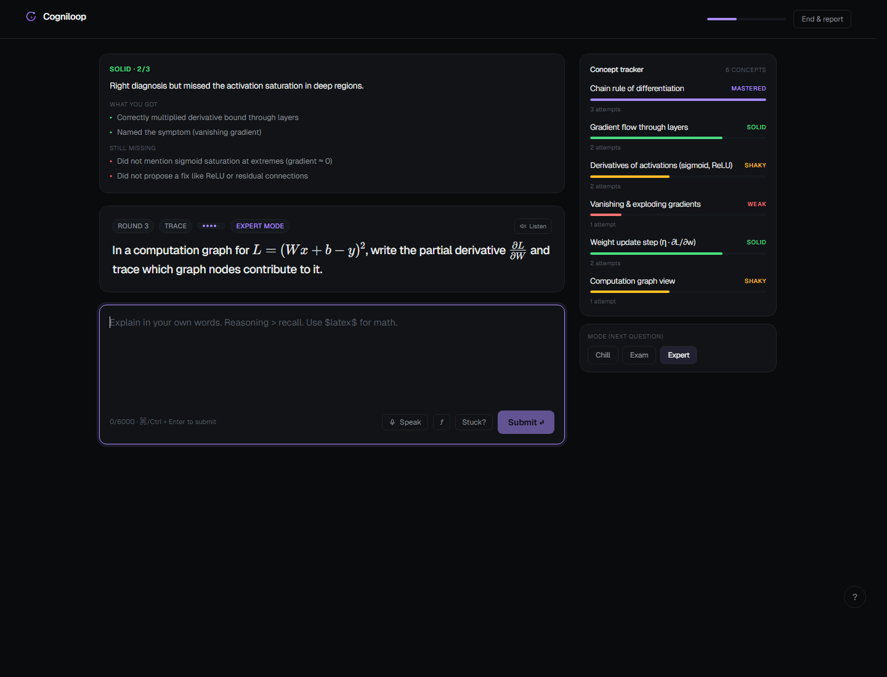
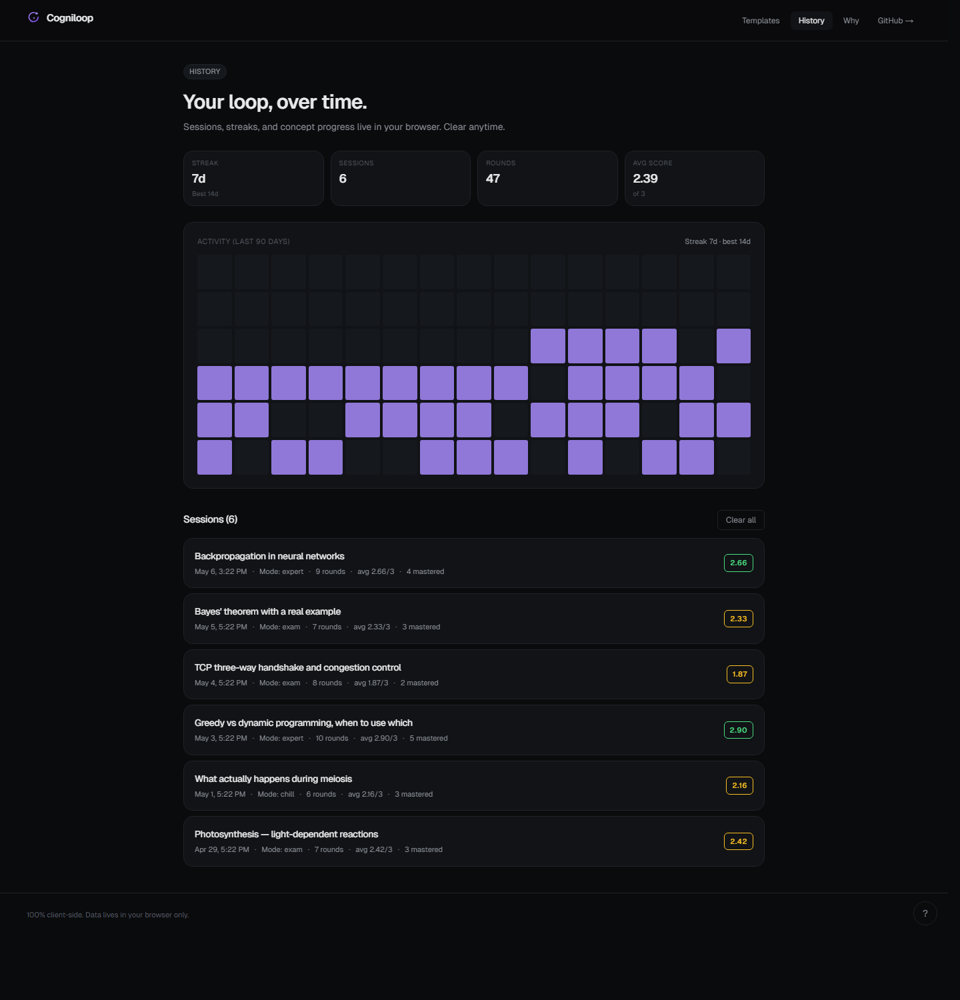
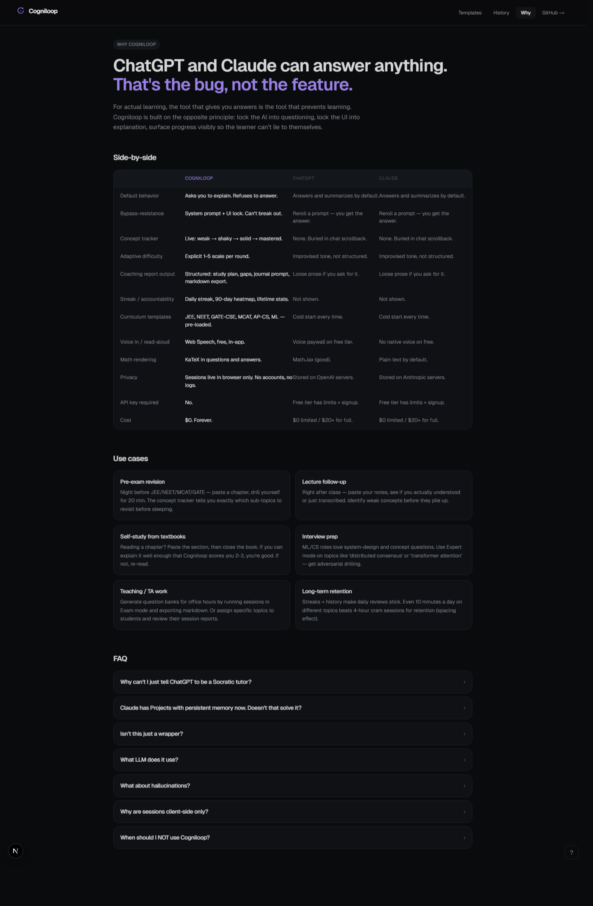

# Cogniloop — LinkedIn Launch Report

> Active-recall AI tutor that refuses to give answers. Free, no signup, no API keys.

**Live:** https://cogniloop-vaibhav4046s-projects.vercel.app
**Repo:** https://github.com/vaibhav4046/cogniloop

---

## 1. Where the gap is (research summary)

Pulled from r/college, r/GetStudying, r/ChatGPT, and academic-help blogs (Jan–May 2026):

| Pain point | Frequency in threads |
|---|---|
| "I use ChatGPT to study but feel I'm not actually learning" | top complaint |
| AI tools default to summarizing → low retention | top complaint |
| Hallucinated citations / fake studies | second-most cited |
| No structure around studying — just chat scrollback | recurring |
| Free LLM tools require signup, hit paywalls quickly | recurring |
| No accountability mechanism (streak / progress) | recurring |
| Math support is weak in most "study GPT" wrappers | recurring |

Cogniloop targets the **first three**. The free tier and structure features address the **rest**.

## 2. Why a focused tool beats general chatbots

ChatGPT and Claude can roleplay a tutor. They can also stop tutoring the moment the student says "just give me the answer." The tutor mode is voluntary; bypassing it is one prompt away.

Cogniloop's bet is the same one Linear made against Jira, Superhuman against Gmail, and Notion against Google Docs: **opinionated software with a locked workflow beats general tools with the same primitives**. The product is the opinion, not the model.

Three things ChatGPT/Claude structurally don't do:

1. **Refuse to answer.** Cogniloop's system prompt + UI force explanation-first interaction. The user can't say "skip this and explain it yourself" — there is no chat box for that.
2. **Show concept mastery as a structured, persistent data structure.** ChatGPT memory stores text. Cogniloop tracks `weak/shaky/solid/mastered` per concept across sessions, with a 90-day heatmap and lifetime stats.
3. **Output a structured coaching artifact** — markdown export, study plan with minutes, journal prompt — not chat scrollback.

## 3. What was shipped

35+ features across 6 pages:

### Landing (`/`)


- Locked Socratic core, mode picker (Chill / Exam / Expert), example chips, curriculum cards, 12-feature grid, comparison teaser → /why.

### Templates (`/templates`)


- 6 curriculum packs: JEE Main, NEET UG, GATE CSE, MCAT, AP CS, ML Fundamentals
- 80+ pre-loaded topics, click any to start a session immediately
- Topic-level filter

### Study session (`/study`)


- Live concept tracker with strength bars
- Per-round feedback: score, verdict, what-you-got, still-missing
- LaTeX rendering via KaTeX (math problems render natively)
- Voice input via Web Speech API
- Read-aloud questions via Speech Synthesis
- Mode switcher mid-session
- Timer in Exam mode
- Math-syntax cheat sheet + live preview

### History (`/history`)


- Streak counter + 90-day activity heatmap
- Lifetime stats: sessions, rounds, mastered, avg score
- Full session list with score badges

### Why Cogniloop (`/why`)


- Side-by-side comparison vs ChatGPT and Claude
- 6 use cases: pre-exam revision, lecture follow-up, self-study, interview prep, teaching/TA, long-term retention
- 7-question FAQ

### Shared session (`/shared/[token]`)
- URL-encoded base64 payload, no backend, no leaks
- Read-only view for sharing your session report

## 4. Architecture deep-dive

```
Next.js 16 App Router
├── React 19, Tailwind CSS v4, TypeScript strict
├── KaTeX for math
├── 4 edge API routes (/api/session/start | turn | report)
├── Multi-provider LLM with retry + fallback:
│   1. Pollinations.ai (default — no API key needed)
│   2. Groq Llama 3.3 70B (if GROQ_API_KEY env set)
├── localStorage-only persistence (history, streak, in-flight session)
├── URL-safe base64 encoding for shareable session payloads
└── Hosted on Vercel — edge runtime per route
```

Key design decisions:

- **Strict-JSON prompts.** Each API route forces the model into JSON-mode and runs a multi-strategy parser (raw → fenced → slice extraction). No format drift across providers.
- **System prompt as immutable contract.** `SYSTEM_CORE` plus a per-mode overlay (`Chill` / `Exam` / `Expert`) is concatenated before every call. Mode change ≠ prompt regeneration.
- **State machine, not chat history.** Session is `{topic, notes, modeId, concepts[], rounds[]}`, sent in full each turn. Stateless backend, deterministic re-hydration.
- **Concept strength as a 4-state FSM** with explicit transition rules in the prompt — `weak → shaky → solid → mastered` with downgrade on score 0.

## 5. Use cases (LinkedIn-pitchable)

- **Indian engineering aspirants** drilling JEE Main concepts the night before paper.
- **Med school applicants** running MCAT bio modules between practice tests.
- **Bootcamp grads** prepping for ML/system-design interviews on Expert mode.
- **TAs / private tutors** generating personalized question banks via session export.
- **Self-learners** maintaining streaks for ML, languages, history, anything.
- **High-schoolers** in AP CS reviewing class material immediately after lecture.

## 6. Honest limits (what it's NOT)

- Not a homework solver. Won't give step-by-step solutions.
- Not Anki. No flashcard deck management (yet).
- Not a code execution sandbox. Use ChatGPT Code Interpreter for that.
- Pollinations free endpoint can rate-limit (1 req / 15s anonymous). Set `GROQ_API_KEY` for prod.
- Sessions clear if user clears browser data. Markdown export is the durable backup.

## 7. LinkedIn post (paste-ready)

```
Most "AI study tools" are summarizers in a pastel skin.

So I built the opposite: Cogniloop, an AI tutor that REFUSES to give you the answer.

You paste a topic.
The AI extracts the concepts.
It asks you to explain — Feynman-style — across 5 question types.
It grades each answer 0–3, surfaces what you got and what you missed.
It adapts the next round to your weakest concept.

Round by round, you watch your concept tracker shift from
weak → shaky → solid → mastered.

Stack:
• Next.js 16 + React 19 + Tailwind v4 + TypeScript strict
• Edge runtime API routes with strict-JSON prompt engineering
• Multi-provider LLM (Pollinations → Groq Llama 3.3 70B fallback)
• KaTeX math, Web Speech API voice input, Speech Synthesis read-aloud
• localStorage-only persistence (no accounts, no servers, no leaks)
• 6 pre-loaded curriculum packs: JEE, NEET, GATE-CSE, MCAT, AP-CS, ML
• Streak + 90-day heatmap + shareable session links

It's free. No signup. No API keys.

Try it: https://cogniloop-vaibhav4046s-projects.vercel.app
Code: https://github.com/vaibhav4046/cogniloop

Open to AI/ML engineering roles. Feedback is gold.

#AI #MachineLearning #NextJS #EdTech #Engineering #FullStack
```

## 8. Carousel sequence (5 slides, in order)

1. **Slide 1 — Hook**
   `screenshots/landing.png` (top half)
   Caption: *"Most AI study tools summarize for you. This one refuses to."*

2. **Slide 2 — The actual session**
   `screenshots/study.png`
   Caption: *"Live concept tracker. LaTeX math. Adaptive Socratic questions. Round 3 of 8 on backpropagation."*

3. **Slide 3 — Curriculum templates**
   `screenshots/templates.png`
   Caption: *"6 pre-loaded packs: JEE, NEET, GATE-CSE, MCAT, AP-CS, ML. 80+ topics, one click to start."*

4. **Slide 4 — Habit loop**
   `screenshots/history.png`
   Caption: *"Streak. 90-day heatmap. Lifetime stats. Built for daily use."*

5. **Slide 5 — Why not ChatGPT?**
   `screenshots/why.png` (table portion)
   Caption: *"ChatGPT can roleplay a tutor. The next prompt can un-roleplay it. Cogniloop locks the loop."*
